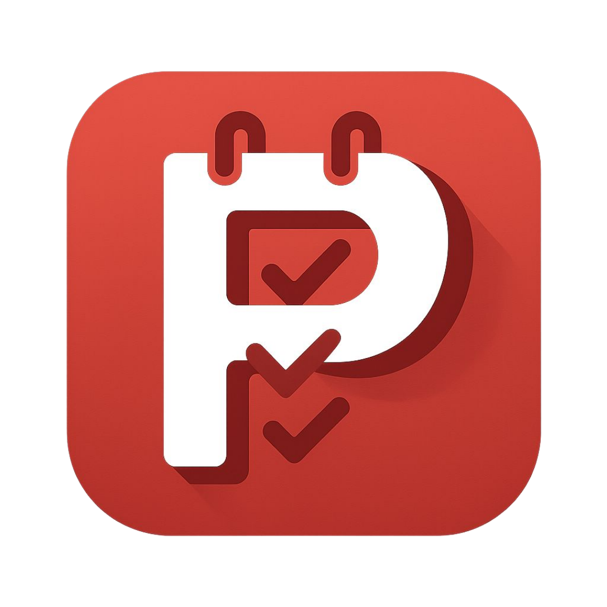

<div align="center"></div>

# <div align="center">PLANORAMA</div>

## A modern, intuitive and feature-rich JavaScript-based task management application

Planorama is a modern web-based task manager that provides a seamless experience for organising your high and low priority tasks. With a sleek, animated interface and robust features like task sorting, filtering, searching, and progress tracking, Planorama helps you stay productive and on top of your responsibilities.

## ✨ Features

  * **Task Management**: Add tasks with descriptions, deadlines, and assign them as high, low, or auto-priority.
  * **Priority-Based Organization**: Tasks are automatically categorised into "High Priority" and "Low Priority" sections, with an option for auto-priority based on approaching deadlines (within 2 days for High Priority).
  * **Task Status Tracking**: Mark tasks as complete, and easily distinguish between pending and completed items.
  * **Filtering Options**: Filter tasks by "All", "Completed", or "Pending" to quickly view specific task subsets.
  * **Search Functionality**: Effortlessly search for tasks by their description.
  * **Dynamic Stats Overview**: Get real-time updates on total, completed, and pending tasks.
  * **Responsive and Interactive UI**:
      * Smooth animations and transitions for a delightful user experience.
      * Dynamic background animations with floating particles.
      * Optimized for various screen sizes, ensuring a seamless experience on desktops and mobile devices.
      * Collapse or expand priority sections for a cleaner view.
      * Toast Notifications, which provides helpful feedback for actions like adding, completing, or deleting tasks.

## 🚀 Live Demo

Experience Planorama live here: [**Planorama**](https://www.google.com/search?q=https://eccentriccoder01.github.io/Planorama)

 <div align="center">
 <p>

[](https://github.com/ellerbrock/open-source-badges/)


 </p>
 </div>

## 📸 Screenshots

<div align="center"></div>

## 📺 Video Explanation

For a detailed walkthrough of Planorama's features and how to use them, check out this video:

**[Insert YouTube Video Link Here]**

## 🛠️ Technologies Used

  * **HTML5**: For structuring the web content.
  * **CSS3**: For styling the application, including:
      * CSS Variables for consistent theming.
      * Glassmorphism effects for a modern look.
      * Keyframe animations for dynamic background and UI elements.
      * Font Awesome for icons.
  * **JavaScript (ES6+)**: For interactive functionality, task management logic, and DOM manipulation.

## ⚙️ How to Run Locally

1.  **Clone the repository:**

    ```bash
    git clone https://github.com/eccentriccoder01/Planorama.git
    ```

2.  **Navigate to the project directory:**

    ```bash
    cd Planorama
    ```

3.  **Open with a Live Server:**
    Planorama requires a live server environment to function correctly, especially for the camera scanning and certain sharing features (due to browser security policies).

      * **VS Code Extension:** If you use VS Code, you can install the "Live Server" extension by Ritwick Dey. Right-click on `index.html` and select "Open with Live Server".
      * **Other options:** You can also use `http-server` (Node.js package) or any other local server software.

    ```bash
    # If you have Node.js installed, you can install http-server globally:
    npm install -g http-server
    # Then navigate to your project directory and run:
    http-server
    ```

    Your default browser will open the application, usually at `http://127.0.0.1:5500` or `http://localhost:8080`.

## Issue Creation ✴
Report bugs and  issues or propose improvements through our GitHub repository.

## Contribution Guidelines 📑

- Firstly Star(⭐) the Repository
- Fork the Repository and create a new branch for any updates/changes/issue you are working on.
- Start Coding and do changes.
- Commit your changes
- Create a Pull Request which will be reviewed and suggestions would be added to improve it.
- Add Screenshots and updated website links to help us understand what changes is all about.

- Check the [CONTRIBUTING.md](CONTRIBUTING.md) for detailed steps...

    
## Contributing is fun🧡

Enhance Planorama with your contributions! Whether you have innovative suggestions, spot bugs, or wish to introduce new features.
Contributions of any kind from anyone are always welcome🌟❕

Your insights are invaluable to us. Reach out to us team for any inquiries, feedback, or concerns.

## 📄 License

This project is open-source and available under the MIT License.

## 📞 Contact

Developed by [Eccentric Explorer](https://eccentriccoder01.github.io/Me)

Feel free to reach out with any questions or feedback\!